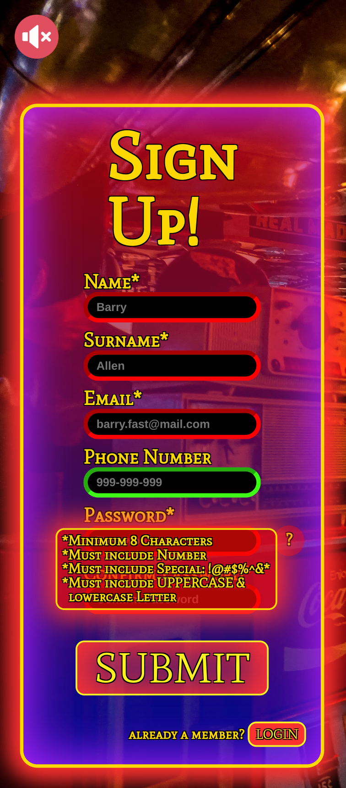

## Sign Up Form

Sign Up Form is a front end project made with Javascript, CSS and HTML.

## Deployment

Available live at: https://charbytesdev.github.io/sign-up-form

## Features

- [x] Password and confirm password validation.
- [x] Tooltip for password format instructions.
- [x] Consistent and compatible with all modern browsers.
- [x] Compatible with all valid screen-sizes.
- [x] Background music and button pressing sound effects (Sound-control button found on top left).

 

 
 

## Built With

- [HTML](https://developer.mozilla.org/en-US/docs/Web/HTML) - Hyper Text Markup Language
- [CSS](https://developer.mozilla.org/en-US/docs/Web/CSS) - Cascading Style Sheets
- [JS](https://developer.mozilla.org/en-US/docs/Web/JavaScript) - Programming Language
